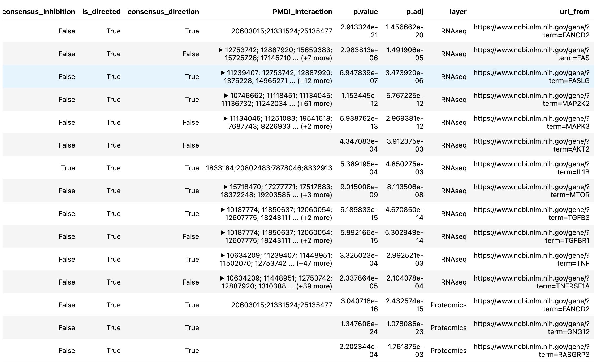
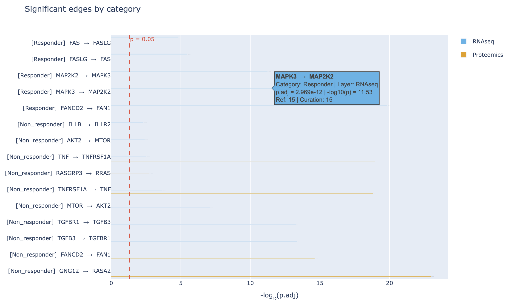
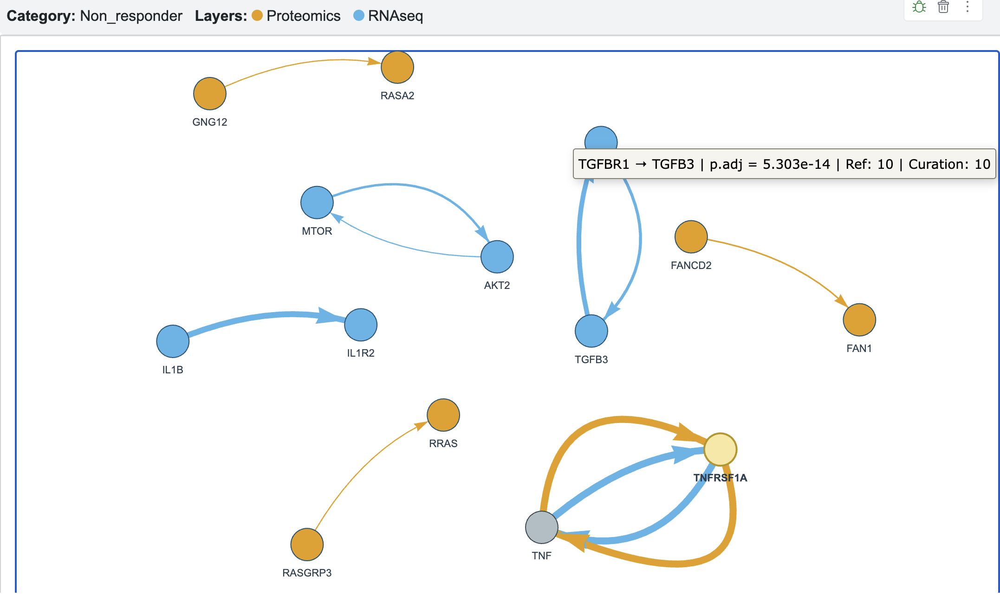
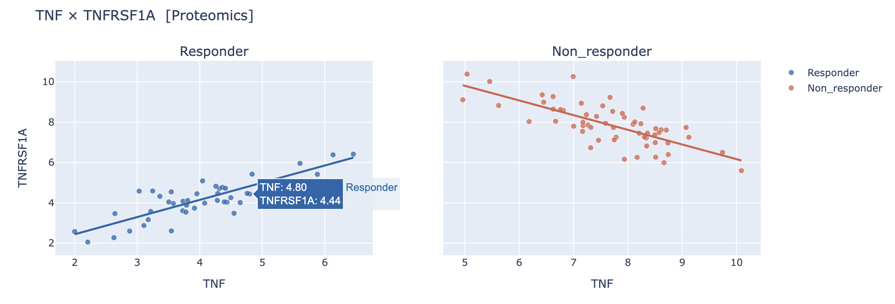
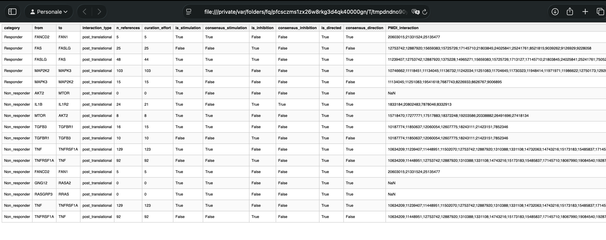

# PyMultiDEGGs

## Overview

**PyMultiDEGGs** is a Python implementation of the original **multiDEGGs R package** by Elisabetta Sciacca et al.

The package performs **differential network analysis** to identify gene–gene and, more generally, entity–entity interactions whose association structure differs between sample categories. It can be applied to both single-omic and multi-omic datasets.

Rather than focusing only on individual molecular features that change between conditions, PyMultiDEGGs investigates how relationships between molecular entities change across groups of samples. These differential interactions can provide insights into biological mechanisms and can also be used as engineered features for downstream predictive modeling.

---

## Installation

### Install from GitHub

The package can be installed directly from GitHub:

```bash
pip install git+https://github.com/cate-messina/PyMultiDEGGs.git
```

Alternatively, clone the repository and install it locally:

```bash
git clone https://github.com/cate-messina/PyMultiDEGGs.git
cd PyMultiDEGGs
pip install .
```

---

## Requirements

* Python ≥ 3.10

The package relies on the following main Python libraries:

* pandas
* numpy
* statsmodels
* joblib
* requests
* beautifulsoup4
* matplotlib
* plotly
* pyvis
* IPython

Dependencies are automatically installed when installing PyMultiDEGGs through `pip`.

---

## Quick Start

### Import

```python
import multideggs as md
```

> **Note:** `metadata` must be provided as a pandas DataFrame with sample IDs as the index. For a single-omic dataset, `assayData` contains features (e.g., genes) in rows and samples in columns. The sample IDs must match between `assayData` and `metadata`.

### Single-omic analysis

For a single-omic dataset, provide the molecular data as a DataFrame:

```python
analysis = md.run_multideggs(
    assayData=rnaseq_df,
    metadata=metadata,
    category_variable="response",
    sig_threshold=0.05,
    verbose=True,
)
```

The analysis returns two objects:

```python
results, final_outputs = analysis
```

* `results` contains the complete differential-network analysis.
* `final_outputs` contains the significant differential interactions selected using the specified `sig_threshold`.

### Multi-omic analysis

Multiple omic layers can be provided as a dictionary of datasets:

```python
assayData = {
    "RNAseq": rnaseq_df,
    "Proteomics": proteomics_df,
    "Olink": olink_df,
}
```

The same analysis function can then be used:

```python
results, final_outputs = md.run_multideggs(
    assayData=assayData,
    metadata=metadata,
    category_variable="response",
    sig_threshold=0.05,
    verbose=True,
)
```

PyMultiDEGGs automatically detects whether the input contains a single omic layer or multiple layers. For multi-omic analyses, the resulting interactions retain information about their corresponding omic layer.

---

## Main Analysis Function

The analysis can be customized using the following parameters:

### Parameters

| Parameter           | Description                                                                        |        Default |
| ------------------- | ---------------------------------------------------------------------------------- | -------------: |
| `assayData`         | Omics data provided as a single dataset or as multiple omic layers.                |              — |
| `metadata`          | Sample annotations indexed by sample IDs.                                          |              — |
| `category_variable` | Column in `metadata` defining the sample groups.                                   |              — |
| `category_subset`   | Optional subset of categories to retain for the analysis.                          |         `None` |
| `padj_method`       | Multiple-testing adjustment method.                                                | `"bonferroni"` |
| `sig_threshold`     | Adjusted p-value threshold used to select significant interactions.                |         `0.05` |
| `percentile_vector` | Percentile thresholds evaluated during the percolation analysis.                   |         `None` |
| `regression_method` | Regression method used for edge testing: `"lm"` or `"rlm"`.                        |         `"lm"` |
| `verbose`           | Whether to print workflow progress and warnings.                                   |         `True` |
| `organism`          | Taxonomic ID of the interaction network.                                           |         `9606` |
| `archive_version`   | OmniPath archive version to use. If `None`, the cached or bundled network is used. |         `None` |

### Example

```python
analysis = md.run_multideggs(
    assayData=assayData,
    metadata=metadata,
    category_variable="response",
    category_subset=None,
    padj_method="bonferroni",
    sig_threshold=0.05,
    percentile_vector=None,
    regression_method="lm",
    verbose=True,
    organism=9606,
    archive_version=None,
)
```

---

## Interaction Network

PyMultiDEGGs uses **OmniPath** as the source of molecular interaction information.

The `organism` parameter specifies the taxonomic identifier used to retrieve the interaction network. The default is human:

```python
organism=9606
```

For example, mouse can be specified with:

```python
analysis = md.run_multideggs(
    assayData=assayData,
    metadata=metadata,
    category_variable="response",
    organism=10090,
)
```

### OmniPath Archive Versions

PyMultiDEGGs uses **OmniPath** as its source of molecular interaction information.

The package includes an **OmniPath archive build** as a bundled human interaction network, available offline. Its metadata are stored in a JSON file containing the archive date, organism, and number of edges.

For reproducible analyses, a specific OmniPath archive build can be selected using `archive_version`. Available builds can be found in the [OmniPath Archive](https://archive.omnipathdb.org/).

Look for files starting with:

```text
omnipath_webservice_interactions__
```

The complete filename has the form:

```text
omnipath_webservice_interactions__20230728-20250813.tsv.xz
```

Use only the portion between `__` and `.tsv.xz` as `archive_version`:

```python
md.update_network(
    organism=9606,
    archive_version="20230728-20250813",
)
```

The two dates (`YYYYMMDD-YYYYMMDD`) indicate the period covered by that archive build. Choose the build whose date range contains the date of the version you want to reproduce.

> **Note 1:** `_latest.tsv.gz` files and `legacy-*` directories should be ignored. Older archive versions may also lack fields introduced in later versions, such as `consensus_direction`, `consensus_stimulation`, `consensus_inhibition`, and `curation_effort`.
>
> **Note 2:** Archive builds contain human data only (`organism=9606`). Specifying `archive_version` together with a non-default organism will trigger a warning, as archived data are human-only.

---

## Results

The analysis returns a tuple containing two objects:

```python
results, final_outputs = analysis
```

### `results`

`results` contains the complete differential-network analysis, including the tested interactions and their statistical results.

### `final_outputs`

`final_outputs` contains the significant differential interactions in a display-friendly table.


For multi-omic analyses, the results also retain information about the corresponding omic layer.

### Final Results Table

The final output combines the results of the differential network analysis with annotations describing the corresponding interactions.

| Column                  | Description                                                                                           |
| ----------------------- | ----------------------------------------------------------------------------------------------------- |
| `category`              | Sample group in which the differential interaction was identified.                                    |
| `from`                  | Gene at the source of the interaction.                                                                |
| `to`                    | Gene at the target of the interaction.                                                                |
| `interaction_type`      | Biological type of interaction between the two genes, as annotated by OmniPath.                       |
| `n_references`          | Total number of PubMed reference entries associated with the interaction.                             |
| `curation_effort`       | Aggregated curation effort across OmniPath records for the interaction.                               |
| `is_stimulation`        | Indicates whether the interaction is annotated as a stimulation.                                      |
| `consensus_stimulation` | Indicates whether there is consensus among the available sources that the interaction is stimulatory. |
| `is_inhibition`         | Indicates whether the interaction is annotated as an inhibition.                                      |
| `consensus_inhibition`  | Indicates whether there is consensus among the available sources that the interaction is inhibitory.  |
| `is_directed`           | Indicates whether the interaction has a defined direction from `from` to `to`.                        |
| `consensus_direction`   | Indicates whether there is consensus among the available sources about the interaction direction.     |
| `PMDI_interaction`      | PubMed identifiers associated with the interaction.                                                   |
| `p.value`               | P-value measuring the statistical significance of the differential interaction.                       |
| `p.adj`                 | Multiple-testing adjusted p-value used to assess significance.                                        |
| `layer`                 | Omic dataset in which the interaction was identified.                                                 |
| `url_from`              | NCBI Gene link for the source gene.                                                                   |
| `url_to`                | NCBI Gene link for the target gene.                                                                   |

---

## Visualization

PyMultiDEGGs provides functions for visualizing the analysis results.

### Summary Plot

```python
md.show_plot(
    analysis,
    plot_type="summary",
)
```


### Differential Network

To visualize the network for a specific category:

```python
md.show_plot(
    analysis,
    plot_type="network",
    category="Responder",
)
```

Specific entities can be highlighted:

```python
md.show_plot(
    analysis,
    plot_type="network",
    category="Responder",
    genes=["TNF", "TNFRSF1A"],
)
```


### Regression Plot

The relationship between two interacting entities can be inspected using:

```python
md.show_plot(
    analysis,
    plot_type="regression",
    gene_A="TNF",
    gene_B="TNFRSF1A",
    assayDataName="Proteomics",
)
```


### HTML Results

Interactive results can be generated with:

```python
md.show_html_results(analysis)
```


---

## Validation

The Python implementation was validated against the original R implementation of multiDEGGs using the same analysis workflow and input data.

The resulting differential network analyses were compared to assess consistency between the two implementations.

---


## Citation

If you use PyMultiDEGGs, please cite the original publications:

**Sciacca E, Alaimo S, Silluzio G, Ferro A, Latora V, Pitzalis C, Pulvirenti A, Lewis MJ (2023).**
*DEGGs: an R package with shiny app for the identification of differentially expressed gene–gene interactions in high-throughput sequencing data.*
Bioinformatics, 39(4), btad192.
https://doi.org/10.1093/bioinformatics/btad192

**Sciacca E, Wang SS, Pitzalis C, Lewis MJ (2026).**
*multiDEGGs: Single or Multiomic Differential Network Analysis for Biomarker Discovery and Feature Engineering for Predictive Modeling.*
Computational and Structural Biotechnology Journal, 35(1), 0001.
https://doi.org/10.34133/csbj.0001

The Python implementation is based on the original multiDEGGs R package.


---

## License

This project is distributed under the **GNU General Public License v3.0 (GPL-3.0)**.

See `LICENSE` for the full license text.
